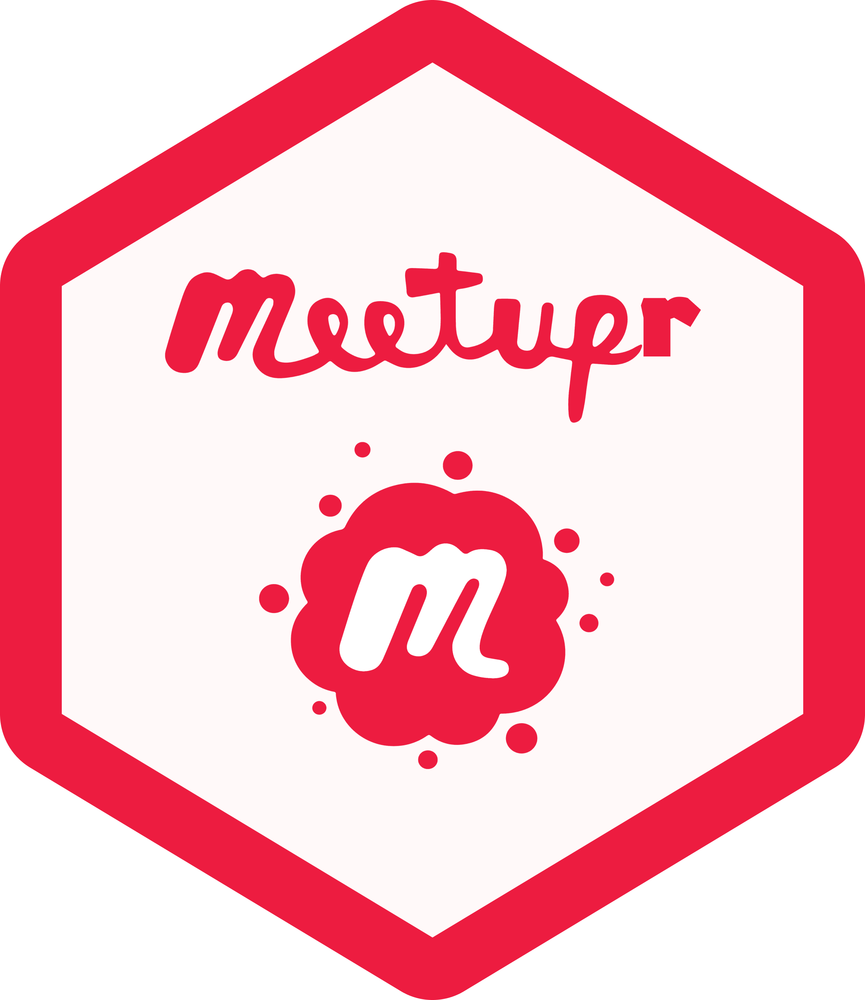

<!-- README.md is generated from README.Rmd. Please edit the Rmd file -->

```{r}
#| include: false
#| label: setup

knitr::opts_chunk$set(
  collapse = TRUE,
  comment = "#>",
  fig.path = "README-",
  eval = meetupr::has_jwt_credentials() || meetupr::has_oauth_credentials()
)

```

# meetupr 

<small>Logo by Zane Dax [@StarTrek_Lt](https://mobile.twitter.com/startrek_lt)</small>

<!-- badges: start -->
[](https://github.com/rladies/meetupr/actions)
[](https://codecov.io/gh/rladies/meetupr?branch=master)
<!-- badges: end -->

R interface to the Meetup GraphQL API

## Installation

To install the current version from R-Universe (recommended):

```r
install.packages(
  'meetupr', 
  repos = c(
    'https://rladies.r-universe.dev', 
    'https://cloud.r-project.org'
  )
)
```

To install the development version from GitHub:

```r
# install.packages("remotes")
remotes::install_github("rladies/meetupr")
```

## Authentication

meetupr uses OAuth 2.0 for authentication with the Meetup API. 
The first time you run a meetupr function, you'll be prompted to authorize the application in your browser. 
Your token will be cached for future sessions.

## Usage

### Get group events

```{r}
#| label: events

library(meetupr)

events <- get_events("rladies-san-francisco", "past")
```

### Get group members

```{r}
#| label: members

members <- get_group_members("rladies-san-francisco")
head(members)
```

### Search for groups

```{r}
#| label: groups

groups <- find_groups("R-Ladies")
dplyr::arrange(groups, desc(founded_date))
```

### Pro network access

For Meetup Pro networks:

```{r}
#| label: pro

# Get all groups in a pro network
pro_groups <- get_pro_groups("rladies")

# Get events from a pro network
pro_events <- get_pro_events("rladies", status = "upcoming")
```

## Contributing

We welcome contributions! 
Please see [CONTRIBUTING.md](CONTRIBUTING.md) for guidelines.

## Code of Conduct

Please note that this project is released with a [Contributor Code of Conduct](https://github.com/rladies/.github/blob/master/CODE_OF_CONDUCT.md).
By contributing to this project, you agree to abide by its terms.
