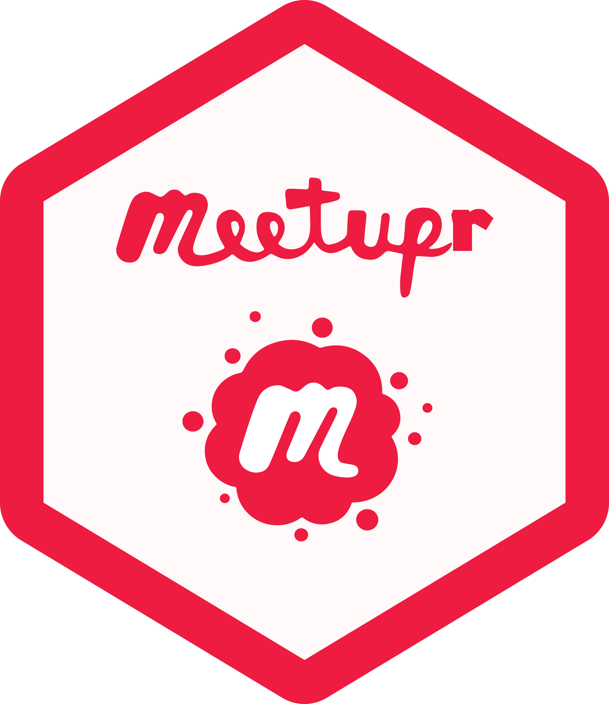

<!-- README.md is generated from README.Rmd. Please edit the Rmd file -->

# meetupr 

<!-- badges: start -->

[](https://CRAN.R-project.org/package=meetupr)
[](https://rladies.r-universe.dev/meetupr)
[](https://opensource.org/licenses/MIT)
[](https://github.com/rladies/meetupr/actions/workflows/R-CMD-check.yaml)
[](https://codecov.io/gh/rladies/meetupr)

<!-- badges: end -->

R interface to the Meetup GraphQL API

## Installation

Install the CRAN version:

``` r
install.packages("meetupr")
```

To install the development version from R-universe:

``` r
install.packages(
  'meetupr', 
  repos = c(
    'https://rladies.r-universe.dev', 
    'https://cloud.r-project.org'
  )
)
```

or from GitHub:

``` r
# install.packages("remotes")
remotes::install_github("rladies/meetupr")
```

## Authentication

meetupr uses OAuth 2.0 for authentication with the Meetup API. The first
time you run a meetupr function, you’ll be prompted to authorize the
application in your browser. Your token will be cached for future
sessions.

## Usage

### Get group events

``` r
library(meetupr)

get_group_events("rladies-san-francisco", "past")
```

    # A tibble: 65 × 23
       id        title  event_url created_time status date_time duration description
       <chr>     <chr>  <chr>     <chr>        <chr>  <chr>     <chr>    <chr>      
     1 85320382  Intro… https://… 2012-10-03T… PAST   2012-10-… PT2H     "Hello R-l…
     2 101032462 R & C… https://… 2013-01-23T… PAST   2013-02-… PT3H     "Hello R-l…
     3 114068102 Tech … https://… 2013-04-12T… PAST   2013-04-… PT3H     "Please RS…
     4 116785522 R & C… https://… 2013-04-29T… PAST   2013-05-… PT2H     "Hello R-l…
     5 130214302 Satur… https://… 2013-07-18T… PAST   2013-07-… PT0S     "For the n…
     6 132414522 Compu… https://… 2013-07-31T… PAST   2013-09-… PT6H     "Hello R-l…
     7 142941582 Compu… https://… 2013-09-29T… PAST   2013-10-… PT5H     "Let's get…
     8 144067982 Compu… https://… 2013-10-05T… PAST   2013-10-… PT5H     "Let's get…
     9 149542642 Let's… https://… 2013-11-06T… PAST   2013-11-… PT0S     "Many of u…
    10 153657632 An Ev… https://… 2013-12-02T… PAST   2013-12-… PT1H30M  "R-Ladies …
    # ℹ 55 more rows
    # ℹ 15 more variables: group_id <chr>, group_name <chr>, group_urlname <chr>,
    #   venues_id <chr>, venues_name <chr>, venues_address <chr>,
    #   venues_city <chr>, venues_state <chr>, venues_postal_code <chr>,
    #   venues_country <chr>, venues_lat <dbl>, venues_lon <dbl>,
    #   venues_venue_type <chr>, rsvps_count <int>, featured_event_photo_url <chr>

### Get group members

``` r
get_group_members("rladies-san-francisco")
```

    # A tibble: 1,868 × 4
       id       name                 member_url                     member_photo_url
       <chr>    <chr>                <chr>                          <chr>           
     1 14534094 Gabriela de Queiroz  https://www.meetup.com/member… https://secure-…
     2 64513952 T. Libman            https://www.meetup.com/member… https://secure-…
     3 25902562 Maggie L.            https://www.meetup.com/member… https://secure-…
     4 2412055  Marsee Henon         https://www.meetup.com/member… https://secure-…
     5 11509157 Jessica Montoya      https://www.meetup.com/member… https://secure-…
     6 2920822  Benay Dara-Abrams    https://www.meetup.com/member… https://secure-…
     7 11405574 Eleanor              https://www.meetup.com/member… https://secure-…
     8 14796891 Jennifer Romanek     https://www.meetup.com/member… https://secure-…
     9 10790320 Member ID: #10790320 https://www.meetup.com/member… https://secure-…
    10 43420932 Milène Darnis        https://www.meetup.com/member… https://secure-…
    # ℹ 1,858 more rows

### Search for groups

``` r
find_groups("R-Ladies") |>
  dplyr::arrange(desc(founded_date))
```

    # A tibble: 200 × 14
       id       name     urlname city  state country   lat     lon memberships_count
       <chr>    <chr>    <chr>   <chr> <chr> <chr>   <dbl>   <dbl>             <int>
     1 38277511 Gurl 2 … gurl-2… Atla… "GA"  us       33.9  -84.4                  1
     2 38274859 The Gol… meetup… Oslo  ""    no       59.9   10.8                  1
     3 38274092 Ladies … ladies… Quee… "AZ"  us       33.2 -112.                   4
     4 38273149 Her Lip… mcdono… McDo… "GA"  us       33.5  -84.0                  8
     5 38271904 Lonely … lonely… Riya… ""    sa       24.6   46.8                  0
     6 38267718 R User … r-nvsu  Mani… ""    ph       14.6  121.                   3
     7 38261472 LA Limi… la-lim… Los … "CA"  us       34.0 -118.                   5
     8 38258200 Entre N… mayore… Madr… ""    es       40.4   -3.71                 1
     9 38253213 Sensual… sensua… Madr… ""    es       40.4   -3.71                 3
    10 38252286 Sortit … sortit… Mari… ""    fr       43.4    5.22                11
    # ℹ 190 more rows
    # ℹ 5 more variables: founded_date <dttm>, timezone <chr>, join_mode <chr>,
    #   is_private <lgl>, membership_status <chr>

### Pro network access

For Meetup Pro networks, note that user needs to be a **pro** network
organizer to access the data.

``` r
# Get all groups in a pro network
pro_groups <- get_pro_groups("rladies")

# Get events from a pro network
pro_events <- get_pro_events("rladies", max_results = 10)
```

## Contributing

We welcome contributions! Please see the [contribution
guidelines](https://github.com/rladies/meetupr/blob/main/.github/CONTRIBUTING.md).

## Code of Conduct

Please note that this project is released with a [Contributor Code of
Conduct](https://github.com/rladies/.github/blob/master/CODE_OF_CONDUCT.md).
By contributing to this project, you agree to abide by its terms.
