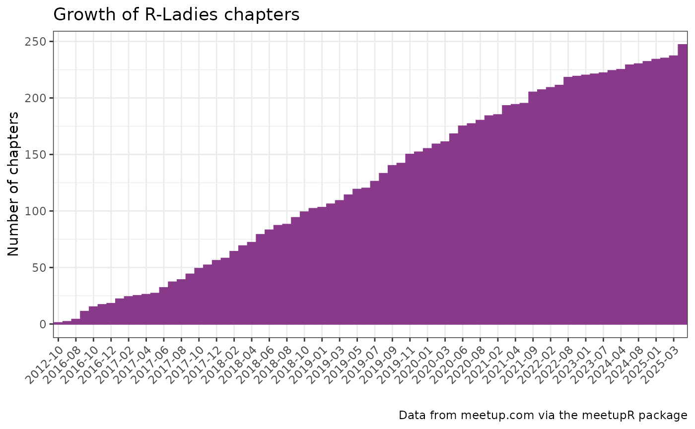
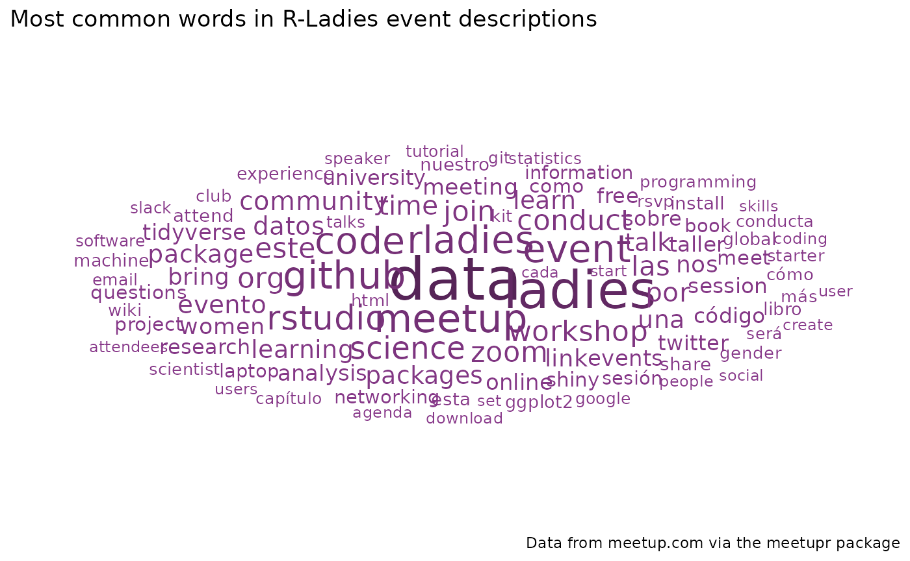

# R-Ladies chapters on meetup.com

## Install and load packages

``` r
library(tidytext)
library(ggwordcloud)
library(dplyr)
library(tidyr)
library(ggplot2)
library(meetupr)
```

## How many R-Ladies chapter are out there?

We can use the
[`find_groups()`](http://rladies.org/meetupr/reference/find_groups.md)
function to search for groups with “r-ladies” in their name. Note that
the function returns up to 200 results, so we will filter them
afterwards.

``` r
meetupr_groups <- find_groups("r-ladies")
meetupr_groups
#> # A tibble: 200 × 14
#>    id       name       urlname city  state country   lat   lon memberships_count
#>    <chr>    <chr>      <chr>   <chr> <chr> <chr>   <dbl> <dbl>             <int>
#>  1 38267718 R User Gr… r-nvsu  Mani… ""    ph       14.6 121.                  3
#>  2 24820200 R-Ladies … rladie… Méxi… ""    mx       19.4 -99.1              2944
#>  3 20378903 R-Ladies … rladie… Melb… ""    au      -37.8 145.               2719
#>  4 32767673 R-Ladies … rladie… Pach… ""    mx       20.1 -98.8                41
#>  5 33041212 R-Ladies … rladie… al-K… ""    sd       15.6  32.5               113
#>  6 35897820 R-Ladies … rladie… Gabo… ""    bw      -24.6  25.9              1132
#>  7 28706674 R-Ladies … rladie… Nite… ""    br      -22.9 -43.1              1281
#>  8 33361775 R-Ladies … rladie… Ha N… ""    vn       21.0 106.                124
#>  9 27456719 R-Ladies … rladie… São … ""    br      -23.5 -46.6              1818
#> 10 28441250 R-Ladies … rladie… San … ""    ar      -41.1 -71.3               588
#> # ℹ 190 more rows
#> # ℹ 5 more variables: founded_date <dttm>, timezone <chr>, join_mode <chr>,
#> #   is_private <lgl>, membership_status <chr>
```

Since the search might return groups that are not actually R-Ladies
chapters, we will filter them by name.

``` r
rladies <- meetupr_groups |>
  filter(grepl("R-Ladies", name, ignore.case = TRUE))

rladies
#> # A tibble: 55 × 14
#>    id       name       urlname city  state country   lat   lon memberships_count
#>    <chr>    <chr>      <chr>   <chr> <chr> <chr>   <dbl> <dbl>             <int>
#>  1 24820200 R-Ladies … rladie… Méxi… ""    mx       19.4 -99.1              2944
#>  2 20378903 R-Ladies … rladie… Melb… ""    au      -37.8 145.               2719
#>  3 32767673 R-Ladies … rladie… Pach… ""    mx       20.1 -98.8                41
#>  4 33041212 R-Ladies … rladie… al-K… ""    sd       15.6  32.5               113
#>  5 35897820 R-Ladies … rladie… Gabo… ""    bw      -24.6  25.9              1132
#>  6 28706674 R-Ladies … rladie… Nite… ""    br      -22.9 -43.1              1281
#>  7 33361775 R-Ladies … rladie… Ha N… ""    vn       21.0 106.                124
#>  8 27456719 R-Ladies … rladie… São … ""    br      -23.5 -46.6              1818
#>  9 28441250 R-Ladies … rladie… San … ""    ar      -41.1 -71.3               588
#> 10 34931513 R-Ladies … rladie… São … ""    br      -18.7 -39.9                24
#> # ℹ 45 more rows
#> # ℹ 5 more variables: founded_date <dttm>, timezone <chr>, join_mode <chr>,
#> #   is_private <lgl>, membership_status <chr>
```

Now, while searching for R-Ladies chapters is a nice way to get started,
a more reliable way is to use the
[`get_pro_groups()`](http://rladies.org/meetupr/reference/get_pro.md)
function, which retrieves all the official R-Ladies chapters. Since
R-Ladies is a pro organization on meetup.com, we can use this function
to get the list of all chapters that are part of the R-Ladies network.

``` r
rladies_pro <- get_pro_groups("rladies")
```

## Growth

Let us now visualize the growth of R-Ladies chapters over time.

``` r
df <- rladies_pro |>
  mutate(
    dategroup = format(founded_date, "%Y-%m")
  ) |>
  group_by(dategroup) |>
  tally() |>
  mutate(
    cum_sum = cumsum(n)
  )

ggplot(
  data = df,
  aes(x = dategroup, y = cum_sum)
) +
  geom_bar(
    stat = "identity",
    color = "#88398A",
    fill = "#88398A"
  ) +
  theme_bw() +
  labs(
    title = "Growth of R-Ladies chapters",
    caption = "Data from meetup.com via the meetupR package",
    x = "",
    y = "Number of chapters"
  ) +
  theme(
    axis.text.x = element_text(angle = 45, vjust = 1, hjust = 1)
  ) +
  scale_x_discrete(
    breaks = df$dategroup[seq(1, length(df$dategroup), by = 2)]
  )
```



## Chapter activity

Let us now extract the number of past events and the dates of last and
next events, for each chapter.

``` r
rladies_events <- get_pro_events("rladies")

event_summary <- rladies_events |>
  group_by(group_name, group_urlname) |>
  summarise(
    n_past = ifelse("PAST" %in% status, length(status), 0),
    last_event = ifelse(
      "PAST" %in% status,
      format(max(date_time[status == "PAST"]), "%Y-%m-%d"),
      NA
    ),
    next_event = ifelse(
      "ACTIVE" %in% status,
      format(min(date_time[status == "ACTIVE"]), "%Y-%m-%d"),
      NA
    )
  )
event_summary
#> # A tibble: 231 × 5
#> # Groups:   group_name [228]
#>    group_name            group_urlname        n_past last_event next_event
#>    <chr>                 <chr>                 <int> <chr>      <chr>     
#>  1 R Ladies Aarhus       rladies-aarhus            1 2021-06-16 NA        
#>  2 R Ladies Fort Collins rladies-fort-collins      4 2025-06-27 2025-12-15
#>  3 R Ladies Guanajuato   rladies-guanajuato        3 2025-03-08 NA        
#>  4 R Ladies Singapore    rladies-singapore-sg      4 2025-01-12 NA        
#>  5 R Ladies Temuco       rladies-temuco            4 2025-10-06 NA        
#>  6 R Ladies Tepic        rladies-tepic             3 2025-03-13 NA        
#>  7 R Ladies Tirane       rladies-tirane            7 2025-10-29 2025-12-16
#>  8 R Ladies Zagreb       rladies-zagreb            2 2024-12-17 NA        
#>  9 R-Ladies Abuja        rladies-abuja            32 2025-10-25 NA        
#> 10 R-Ladies Accra        rladies-accra             2 NA         NA        
#> # ℹ 221 more rows
```

*Which chapters have never had events and have not even planned one (and
have been created more than 6 months ago)?*

``` r
rladies <- rladies_pro |>
  rename(group_urlname = urlname) |>
  left_join(event_summary, by = "group_urlname")

rladies |>
  filter(
    n_past == 0,
    is.na(next_event),
    founded_date < Sys.Date() - 6 * 30
  ) |>
  arrange(founded_date)
#> # A tibble: 0 × 21
#> # ℹ 21 variables: id <chr>, name <chr>, group_urlname <chr>, description <chr>,
#> #   lat <dbl>, lon <dbl>, city <chr>, state <chr>, country <chr>,
#> #   membership_status <chr>, memberships_count <int>, founded_date <dttm>,
#> #   pro_join_date <dttm>, timezone <chr>, join_mode <chr>, who <chr>,
#> #   is_private <lgl>, group_name <chr>, n_past <int>, last_event <chr>,
#> #   next_event <chr>
```

*Which chapters had no events in the past 6 months and have not even
planned one?*

``` r
rladies |>
  filter(
    last_event < as.POSIXct("2019-03-29"),
    is.na(next_event)
  ) |>
  arrange(last_event)
#> # A tibble: 0 × 21
#> # ℹ 21 variables: id <chr>, name <chr>, group_urlname <chr>, description <chr>,
#> #   lat <dbl>, lon <dbl>, city <chr>, state <chr>, country <chr>,
#> #   membership_status <chr>, memberships_count <int>, founded_date <dttm>,
#> #   pro_join_date <dttm>, timezone <chr>, join_mode <chr>, who <chr>,
#> #   is_private <lgl>, group_name <chr>, n_past <int>, last_event <chr>,
#> #   next_event <chr>
```

## Wordcloud of events

Finally, let us create a wordcloud of the most common words in the event
descriptions of all R-Ladies chapters.

``` r
# Strip html tags from event descriptions
strip_html <- function(x) {
  sapply(x, function(x) {
    gsub("<[^>]+>", "", x)
  })
}

#' custom function to create wordcloud data
rladies_wc <- function(data, column, n = 100) {
  data |>
    unnest_tokens(word, {{ column }}) |>
    anti_join(stop_words, by = "word") |>
    filter(
      !grepl("^[0-9]+$", word),
      nchar(word) > 2,
      !word %in% c("p", "br", "href", "http", "https", "class", "www", "com"),
      !word %in%
        c(
          "de",
          "la",
          "et",
          "les",
          "des",
          "le",
          "en",
          "un",
          "une",
          "du",
          "para",
          "con",
          "del",
          "el",
          "se",
          "y",
          "los",
          "es"
        )
    ) |>
    count(word, sort = TRUE) |>
    slice_max(n, n = n) |>
    ggplot(aes(
      label = word,
      size = n,
      color = n
    )) +
    geom_text_wordcloud() +
    scale_size_area(max_size = 12) +
    scale_color_gradient(
      low = "#88398A",
      high = "#562457"
    ) +
    theme_minimal()
}
```

``` r
rladies_wc(rladies_events, description) +
  labs(
    title = "Most common words in R-Ladies event descriptions",
    caption = "Data from meetup.com via the meetupr package"
  )
```


